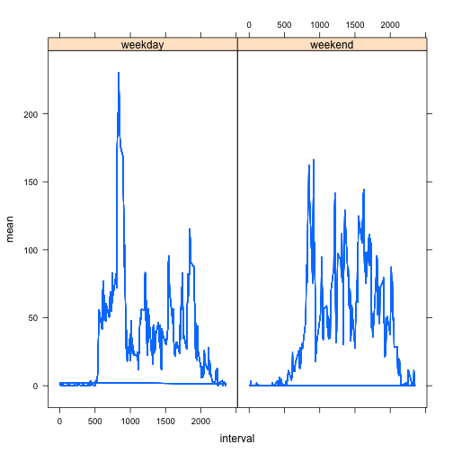

Peer Assessment 1 - Reproducible Research
========================================================

Step one: load the data into R, and load all libraries (used at later steps).


```r
library(data.table)
library(lattice)
data <- read.csv(unz("activity.zip", "activity.csv"), header = TRUE, sep = ",", 
                 colClasses = c("numeric", "Date", "numeric"))
```

First I want to work with a dataset without the missing values; I chose to generate a clean dataset, where the "NA" values were removed.


```r
compl <- complete.cases(data)
cleandata <- data[compl,]
dt <- data.table(cleandata)
```

For the first analysis, I want to look at the total number of steps per day. Therefore, I generate a clean subset data table containing the sum of the steps per day. 


```r
spd <- dt[,sum(steps), by = date]
```

To look at this data, I generate
- a histogram
- calculate the mean
- calculate the median


```r
hist(spd$V1, breaks = nrow(spd), main = paste("Histogram of total number of steps per day"))
```

 

```r
mean(spd$V1)
```

```
## [1] 10766
```

```r
median(spd$V1)
```

```
## [1] 10765
```

Next, I want to look at the average number of steps per interval. Therefore, I generate a subset of the data containing the average number of the steps, look at a plot of this data, and look at the maximum average value per interval.


```r
spi <- dt[,mean(steps), by = interval]
plot(spi$interval, spi$V1, type="l", xlab = "5-min-intervals", ylab = "mean steps")
```

 

```r
print(spi[max(spi$V1)])
```

```
##    interval   V1
## 1:     1705 56.3
```

The next steps assess the impact of missing data on the dataset, and to monitor differences between weekdays (Monday - Friday) and the weekend. First, I look at how many datasets are missing values.


```r
print(nrow(data) - nrow(cleandata))
```

```
## [1] 2304
```

Now I add the weekdays to my data table, and then replace the missing values with the mean of the respective interval.


```r
data$wddata <- weekdays(data$date)
dtwd <- data.table(data)
na.steps <- which(is.na(dtwd$steps))
na.interval <- dtwd$interval[na.steps]
dtwd$steps[na.steps] <- spi$V1[match(na.interval, spi$interval)]
```

Now, I want to look at the steps per day in the dataset where the missing values were replaced. Therefore, I generate a sub-dataset, and then plot a histogram and calculate mean and median as before.


```r
spdwd <- dtwd[,sum(steps), by = date]
hist(spdwd$V1, breaks = nrow(spdwd), main = paste("Histogram of total number of steps per day"))
```

 

```r
mean(spdwd$V1)
```

```
## [1] 10766
```

```r
median(spdwd$V1)
```

```
## [1] 10766
```

Replacing the missing values the way I chose to do it has centralised the data (more symmetrical), by making the mean and median exactly equal now; and the histogram shows that the central bar is far higher now than in the previous histogram. These results are not surprising, since all I added are "central" data (i.e. a calculated mean; for the 5-minute-interval, which of course generate the numbers of steps per days) and no variability was added.
  
  
A more ideal way to replace missing values might be something more time-intensive like assessing the data distribution (without NAs), generating several (n) sets of random data with 2304 datapoints with the same mean and standard deviation as the original data without NA, adding these random data sets one at a time to the non-NA data, and running the desired statistics/tests n times, once each for data without NA + random dataset. This would require more thoughts on a control dataset, and more information on the data would be very helpful.   
  
  

Now, I assign two groups: Monday - Friday are weekdays, Saturday - Sunday are weekend.


```r
dtwd$week[dtwd$wddata == "Monday"| dtwd$wddata == "Tuesday" | dtwd$wddata == "Wednesday" | dtwd$wddata == "Thursday" | dtwd$wddata == "Friday"] <- "weekday"
dtwd$week[dtwd$wddata == "Saturday"| dtwd$wddata == "Sunday"] <- "weekend"
dtwd$intweek <- paste(dtwd$interval, dtwd$week)
```

I then plot the mean number of steps per interval, split into the weekdays vs. weekend days.


```r
spwdwd <- dtwd[,mean(steps), by = intweek]
dtwd$mean <- spwdwd$V1[match(dtwd$intweek, spwdwd$intweek)]
xyplot(mean ~ interval | week, data = dtwd, type = "l")
```

 


